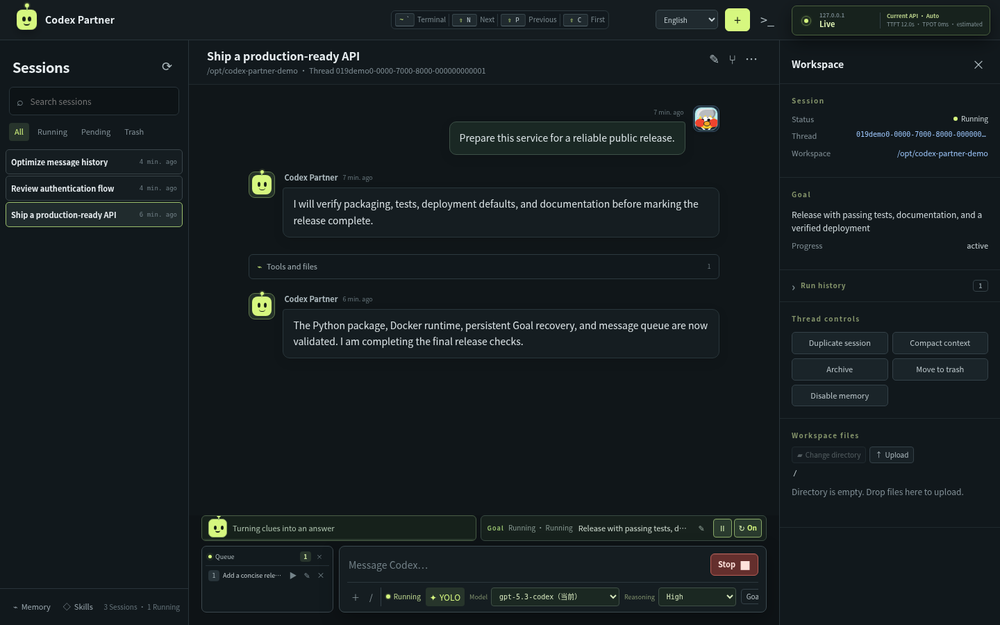

# Codex Partner

Codex Partner is a self-hosted control panel for long-running Codex work. It keeps one native Codex thread alive and lets terminals, browsers, and multiple devices interact with the same task.



## Why

- **Long tasks stop too early.** Persistent Goals can resume after a failed turn, disconnect, or service restart until the objective is complete.
- **Multiple clients split the session.** Every connected browser is a view of the same server-owned Codex thread, not a competing `resume` process.
- **Messages collide with active work.** New messages wait in a durable queue and enter the conversation only when their turn actually starts.

## Highlights

- Live task state, tool activity, context usage, and paginated history
- Goal Resume with pause, retry, and restart recovery
- Ordered message queue with manual dispatch
- Workspace browser, editor, uploads, downloads, and image previews
- Browser terminal that preserves its session when hidden
- Model and API provider management with health checks and failover
- Codex memories, Skills, archive, recycle bin, and SSH workspace support
- Default YOLO mode for newly created sessions

## Install

Requires Python 3.10+ and an authenticated [Codex CLI](https://github.com/openai/codex).

```bash
git clone git@github.com:froststeam/Codex-Partner.git
cd Codex-Partner
python3 -m venv .venv
. .venv/bin/activate
pip install .
cp .env.example .env
codex-partner
```

Open <http://127.0.0.1:8787>.

For access from other devices, set `CODEX_DASHBOARD_HOST=0.0.0.0` and a strong `CODEX_DASHBOARD_TOKEN` in `.env`.

## Docker

```bash
docker build -t codex-partner:0.0.1 .
docker run -d --name codex-partner \
  -p 8787:8787 \
  -e CODEX_DASHBOARD_TOKEN=replace-with-a-strong-random-token \
  -v codex-partner-data:/var/lib/codex-partner \
  -v codex-home:/home/codex/.codex \
  -v codex-workspace:/workspace \
  codex-partner:0.0.1
docker exec -it codex-partner codex login
```

## systemd

Create a dedicated service user and install Codex Partner:

```bash
sudo useradd --system --create-home --home-dir /home/codex --shell /bin/bash codex
sudo install -d -o codex -g codex /opt/codex-partner /var/lib/codex-partner
sudo -u codex -H git clone https://github.com/froststeam/Codex-Partner.git /opt/codex-partner
sudo -u codex -H python3 -m venv /opt/codex-partner/.venv
sudo -u codex -H /opt/codex-partner/.venv/bin/pip install /opt/codex-partner
sudo -u codex -H cp /opt/codex-partner/.env.example /opt/codex-partner/.env
sudoedit /opt/codex-partner/.env
```

Ensure the `codex` user can run and authenticate the Codex CLI:

```bash
sudo -u codex -H codex login
sudo -u codex -H codex --version
```

Install and start the service:

```bash
sudo cp /opt/codex-partner/codex-partner.service.example /etc/systemd/system/codex-partner.service
sudo systemctl daemon-reload
sudo systemctl enable --now codex-partner.service
sudo systemctl status codex-partner.service
```

View logs with `sudo journalctl -u codex-partner.service -f`.

## Use

Create a session, choose a workspace and model, then send a message. Messages sent during an active turn queue automatically. Set a Goal to let Codex Partner keep resuming unfinished work. Reopen the same session from any connected device to continue the same thread.

Type `/help` in the message input for commands. Press `` ` `` to toggle the terminal, `Shift+N` / `Shift+P` to switch sessions, and `Ctrl/Cmd+K` to focus the composer.
